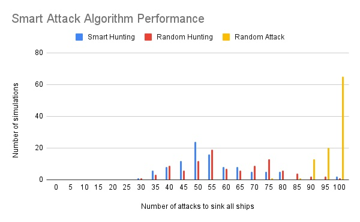

# battleship
Classic Battleship game where users place ships and take turns placing attacks on their opponents boards.

-><a href="https://sumedh-inamdar.github.io/battleship/">link to page</a> <-

JS modules were designed to be loosely coupled and employ pure functions as much as possible. The control modules were subdivided by each phase of the game (setup, ship placement, gameplay). DOM rendering modules were kept seperate with their sole resposibility to handle updating / rendering the DOM. 

Factory functions were used (in place of classes) to create Gameboard, Player, and Ship objects. The factory functions were created through a test driven development (TDD) methodology with unit tests generated prior to control / DOM module development.

## Computer AI algorithm

A computer smart attack algorithm was also developed as described below:

1. Hunting mode: Find the longest stretch of blanks (no attacks) and select one of their midpoints. By breaking the stretch of blanks into smaller chunks, the probabilty of finding a ship increases over firing at random targets (see data below from 100 simulations / mode). 

| # of hits to sink all ships| Smart Hunting |Random Hunting | Random Attack |
| ----------- | ----------- |----------- |----------- |
| Mean      | 52.8|59.17|95.62|
| Median   | 50|55.5|97|
| Std Dev   | 13.37|15.32|4.58|

2. Targeting mode: Once a ship has been hit, the adjacent blank spaces are randomly selected as the next target until a second hit is registered. Hits are then selected along the linear path of the first and second hit until the ship is sunk or a blank space is found, after which the linear path is reversed and hits commence on the first blank space in the reverse order. If no valid attack location is available, hits commence on the adjacent locations of any previous logged hits which did not result in a sunk ship. 

## New lessons / material incorporated
- Test driven design (TDD) / Unit testing through Jest
- Pure function development
- Linting (ESLint), Prettier, and Unicorn

## Future
- [x] Optimize AI attack (binary search instead of random)

## To-do list
- [X] Delete commented code ('// DELETE IF NO ISSUES')
- [X] Hide computer ships
- [X] Add back in random delay for computers turn
- [x] Logic for computer to choose nearby square if successful hit
- [x] Add ability for user to place ships
- [x] End game message
- [x] Remember to remove exporting private functions / variables
- [x] Reveal loser's ship locations

## Bugs to fix

